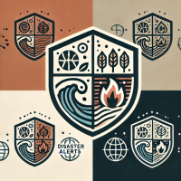
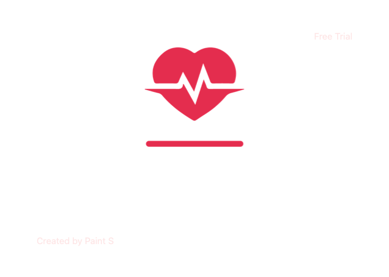

  <h1>Disaster Alerts</h1>
  

Aplikacja realizuje funkcjonalności systemu wczesnego ostrzegania o kataklizmach oraz klęskach żywiołowych.

### Wykorzystane technologie

 

 

 

### Demo

Wersja demonstracyjna dostępna pod adresem http://3.72.61.217:8080/

### Jak uruchomić

Jeżeli posiadasz Git oraz Docker możesz w łatwy sposób uruchomić aplikację z poziomu konsoli systemowej gdzie z wykorzystaniem wymienionych narzędzi wystarczy kolejno wywołać komendy:
- git clone https://github.com/jkuznik/disaster-alerts.git
- cd disaster-alerts
- docker-compose up

To wszysto! Aplikacja będzie dostępna pod adresem [localhost:8081](localhost:8081)

\* <i> pierwsze uruchomienie aplikacji wymaga pobrania obrazów dockerowych co może wydłużyć czas uruchamiania

# Autorzy

[YamiHeike](https://github.com/YamiHeike) - Zuza  
[RobertoJavaDev](https://github.com/RobertoJavaDev) - Robert  
[Slawek84PL](https://github.com/Slawek84PL) - Sławek  
[jkuznik](https://github.com/jkuznik) - Janusz  

 
 
 
Projekt został stworzony w ramach konkursu organizowanego przez społeczność "Zaprogramuj życie".

  

